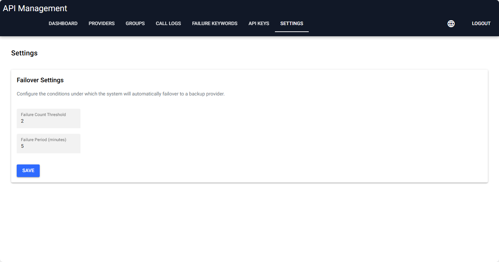
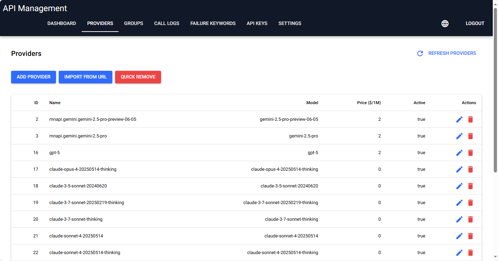
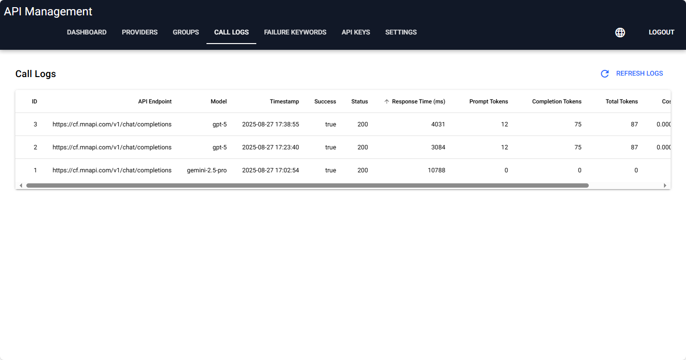
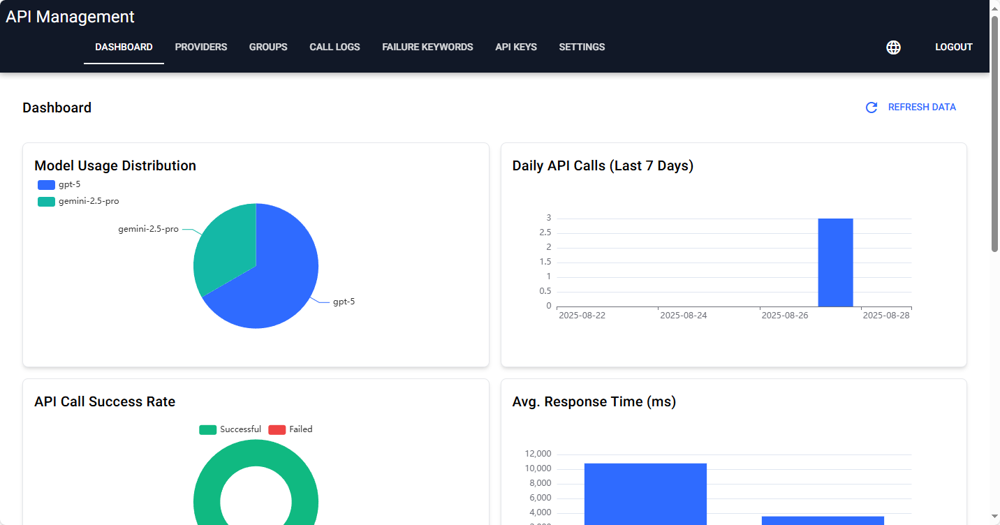

[English](README.md) | [简体中文](README_zh-CN.md) | [繁體中文](README_zh-TW.md) | [한국어](README_KO.md) | [日本語](README_JA.md)

---
# AI Provider API Server

An intelligent API server to manage and route requests to various AI providers, inspired by leading open-source proxy solutions. This server provides a unified, OpenAI-compatible API endpoint for various downstream AI models and services. Its core strength lies in its powerful and flexible API routing and filtering capabilities.

## ✨ Core Feature: Intelligent API Routing

The primary function of this server is to act as a smart intermediary between your applications and various AI model providers. You can define a pool of provider endpoints and group them together, allowing the server to dynamically select the best one for each incoming request based on a set of rules.

### How It Works

1.  **Providers**: You first register individual AI provider endpoints. Each provider has its own API key, endpoint URL, and cost information (e.g., price per million tokens).

2.  **Groups**: You then create "Groups" and add providers to them. A group acts as a virtual, unified model endpoint. For example, you could create a group named `gpt-4-pool` containing endpoints from multiple providers that all serve GPT-4 class models.

3.  **Priority-Based Routing**: Within a group, you assign a `priority` number to each provider. When a request comes in for that group, the server will first attempt to use the provider with the lowest priority number (e.g., priority `1`).

4.  **Automatic Failover**: If the highest-priority provider fails (e.g., due to an API error, network issue, or rate limit), the server automatically and seamlessly retries the request with the next provider in the priority list. This continues until the request is successful or all providers in the group have been tried.

5.  **API Call**: Your application makes a standard OpenAI-compatible API call, but instead of specifying a model name like `gpt-4-turbo`, you specify the **group name** (e.g., `gpt-4-pool`) as the `model`.

This architecture provides high availability, cost optimization (by prioritizing cheaper providers), and simplifies your client-side logic significantly.

## 💎 More Features

*   **OpenAI Compatibility**: Seamlessly integrate your existing tools and libraries with support for `/v1/chat/completions` and `/v1/models` endpoints.
*   **Advanced API Key Management**: Generate API keys and assign them to specific groups for granular control over model access.
*   **Model Importer**: Quickly import models from any OpenAI-compatible provider. Supports aliasing, filtering, and keyword exclusion for easy organization.
*   **Streaming Support**: Full support for streaming responses for a real-time chatbot experience.
*   **Configurable Failover**: Fine-tune the failover logic through the web UI, setting thresholds and time windows for retries.

## 🖥️ Visual Admin Dashboard

The application includes a modern, feature-rich admin dashboard built with [NiceGUI](https://nicegui.io/).

*   **Interactive Dashboard**: Visualize API usage with multiple charts, including model distribution, daily traffic, success rates, and average response times.
*   **Multi-Language Support**: The interface is available in multiple languages, including English, Chinese, Japanese, and Korean.
*   **Provider & Group Management**: Add, edit, and group your AI model providers in an intuitive interface.
*   **Detailed Call Logs**: Inspect detailed logs for every API request, including HTTP status, response time, token usage, and cost.
*   **Failure Keywords**: Define keywords that trigger an automatic retry if found in a provider's response.

## 🖼️ Features Gallery

| Settings | Providers | Groups |
| :---: | :---: | :---: |
|  |  |  |
| Configure global settings, such as the UI language and failover retry logic. | Manage all your AI provider endpoints, including credentials, costs, and a powerful model importer. | Group multiple providers together to create a virtual endpoint with priority-based failover. |

| Call Logs | API Keys | Failure Keywords |
| :---: | :---: | :---: |
|  |  |  |
| Inspect detailed logs for every API call. Click on a log to view the full response content, along with cost details. | Generate and assign API keys to specific groups for granular access control. | Define keywords that trigger automatic failover if found in a provider's response. |

| Dashboard |
| :---: |
|  |
| Monitor real-time API usage, success rates, and performance metrics at a glance. |

##  Getting Started

Follow these instructions to get the API server up and running on your local machine.

### Prerequisites

*   Python 3.8+
*   An ASGI server like Uvicorn

### Installation

1.  **Clone the repository:**
    ```bash
    git clone https://github.com/felixszeto/NiceAPI.git
    cd NiceAPI
    ```

2.  **Create and activate a virtual environment (recommended):**
    ```bash
    python -m venv venv
    # On Windows
    venv\Scripts\activate
    # On macOS/Linux
    source venv/bin/activate
    ```

3.  **Install the dependencies:**
    ```bash
    pip install -r requirements.txt
    ```

4.  **Configure your environment:**
    Create a `.env` file with the following content:
    ```env
    # .env

    # The database file will be created in the root directory
    DATABASE_URL="sqlite:///./api_server.db"

    # Admin user credentials for the web UI
    ADMIN_USERNAME="admin"
    ADMIN_PASSWORD="password"
    ```
    The application uses SQLite by default, so no external database server is required. You can change the `ADMIN_USERNAME` and `ADMIN_PASSWORD` as needed.

### Running the Application

The application will automatically create and initialize the database on the first run.

To start the server, simply run the provided batch file:

```bash
start.bat
```

Alternatively, you can run it directly with `uvicorn`:

```bash
uvicorn main:app --reload --port 8001 --host 0.0.0.0
```

The server will be available at `http://localhost:8001`.

## 🖥️ Accessing the Web UI

Once the server is running, you can access the management interface by navigating to `http://localhost:8001` in your web browser.

**Default Login Credentials:**
*   **Username:** `admin`
*   **Password:** `password`

You can change these credentials in the `.env` file.

After logging in, you can:
*   Monitor API usage on the **Dashboard**.
*   Add, edit, and **import** AI **Providers**.
*   Create **Groups** and assign providers to them with specific priorities.
*   Generate and manage **API Keys** and assign them to groups.
*   View detailed API **Call Logs**.
*   Manage **Failure Keywords** for automatic failover.
*   Adjust global **Settings**, such as the failover logic.

## 🤖 API Usage

To use the API, send a request to the `v1/chat/completions` endpoint.

**Important:** The `model` parameter in your request body should be the **name of the Group** you configured in the web UI. The server will then select a provider from that group based on your routing rules.

### Example with `curl`

Here's an example of how to make a request using `curl`. Replace `YOUR_API_KEY` with a valid key and `your-group-name` with the name of the group you want to use.

```bash
curl http://localhost:8001/v1/chat/completions \
  -H "Content-Type: application/json" \
  -H "Authorization: Bearer YOUR_API_KEY" \
  -d '{
    "model": "your-group-name",
    "messages": [
      {
        "role": "user",
        "content": "Hello, how are you?"
      }
    ],
    "stream": false
  }'
```

The response will be a standard OpenAI-compatible JSON object from the selected provider.

## 📜 License

This project is licensed under the MIT License - see the [LICENSE](LICENSE) file for details.
