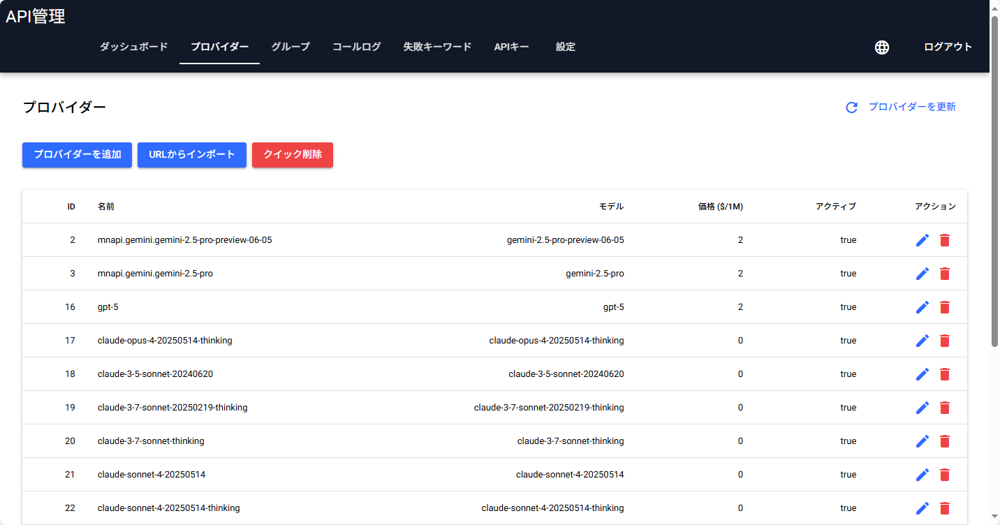
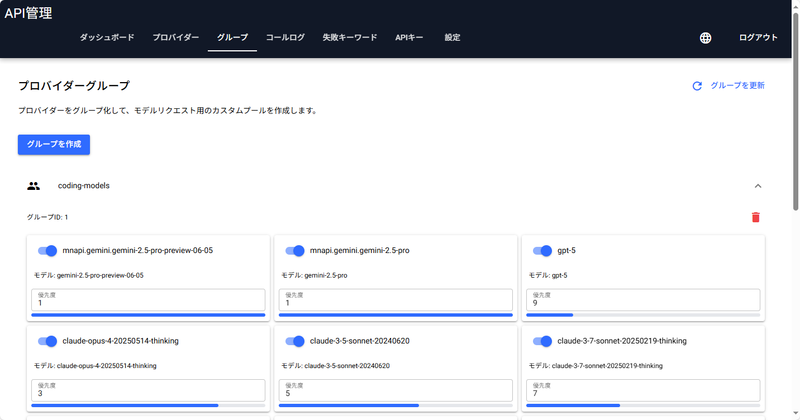
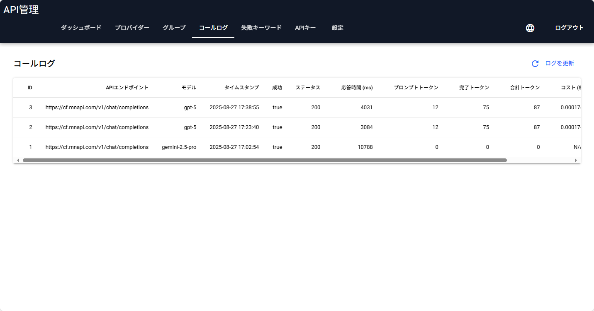
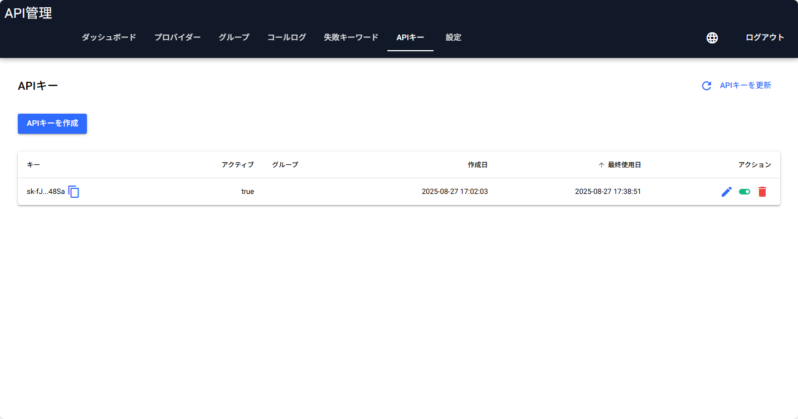
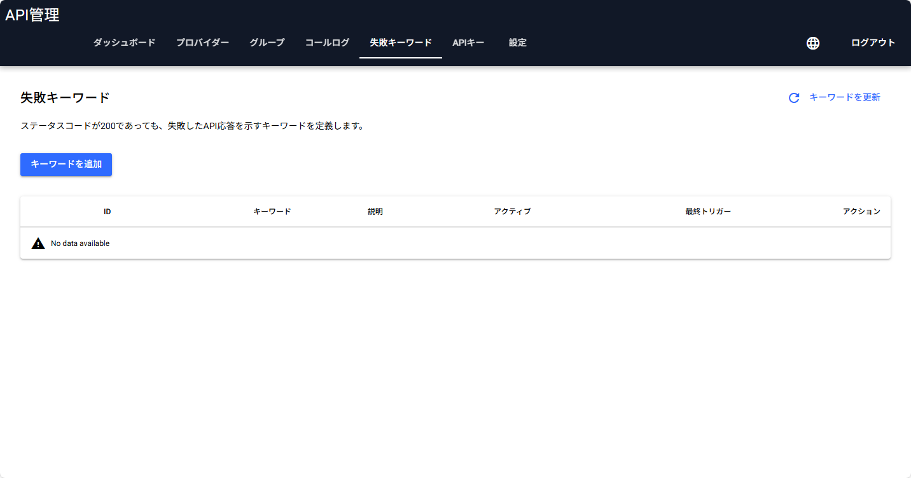
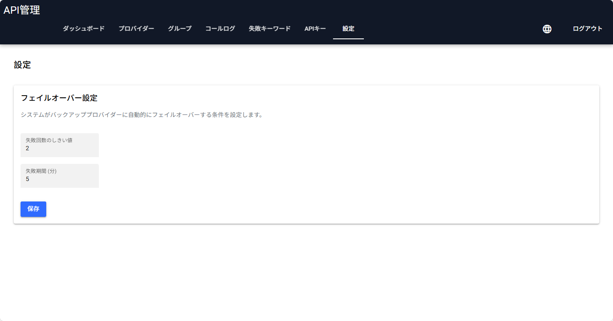

[English](README.md) | [中文](README_ZH.md) | [한국어](README_KO.md) | [日本語](README_JA.md)

---
# AIプロバイダーAPIサーバー

主要なオープンソースプロキシソリューションに触発された、さまざまなAIプロバイダーへのリクエストを管理およびルーティングするためのインテリジェントなAPIサーバーです。このサーバーは、さまざまなダウンストリームAIモデルおよびサービス向けに、統一されたOpenAI互換のAPIエンドポイントを提供します。その中心的な強みは、強力で柔軟なAPIルーティングおよびフィルタリング機能にあります。

## ✨ コア機能：インテリジェントなAPIルーティング

このサーバーの主な機能は、アプリケーションとさまざまなAIモデルプロバイダーとの間のスマートな仲介役として機能することです。プロバイダーエンドポイントのプールを定義してグループ化し、サーバーがルールセットに基づいて各着信リクエストに最適なものを動的に選択できるようにします。

### 仕組み

1.  **プロバイダー（Providers）**：最初に、個々のAIプロバイダーのエンドポイントを登録します。各プロバイダーには、独自のAPIキー、エンドポイントURL、およびコスト情報（例：100万トークンあたりの価格）があります。

2.  **グループ（Groups）**：次に、「グループ」を作成し、プロバイダーを追加します。グループは、仮想の統一されたモデルエンドポイントとして機能します。たとえば、複数のプロバイダーからGPT-4クラスのモデルを提供するエンドポイントを含む`gpt-4-pool`という名前のグループを作成できます。

3.  **優先度ベースのルーティング（Priority-Based Routing）**：グループ内で、各プロバイダーに`priority`番号を割り当てます。そのグループへのリクエストが来ると、サーバーは最初に最も低い優先度番号（例：優先度`1`）を持つプロバイダーを使用しようとします。

4.  **自動フェイルオーバー（Automatic Failover）**：最優先のプロバイダーが失敗した場合（例：APIエラー、ネットワークの問題、またはレート制限のため）、サーバーは優先度リストの次のプロバイダーでリクエストを自動的かつシームレスに再試行します。このプロセスは、リクエストが成功するか、グループ内のすべてのプロバイダーが試行されるまで続きます。

5.  **APIコール**：アプリケーションは標準のOpenAI互換APIコールを行いますが、`model`パラメーターに`gpt-4-turbo`のようなモデル名を指定する代わりに、**グループ名**（例：`gpt-4-pool`）を指定します。

このアーキテクチャは、高可用性、コスト最適化（より安価なプロバイダーを優先することによる）を提供し、クライアント側のロジックを大幅に簡素化します。

## 💎 その他の機能

*   **OpenAI互換性**：`/v1/chat/completions`および`/v1/models`エンドポイントをサポートすることで、既存のツールやライブラリとシームレスに統合します。
*   **高度なAPIキー管理**：APIキーを生成し、特定のグループに割り当てることで、モデルへのアクセスをきめ細かく制御します。
*   **モデルインポーター**：OpenAI互換のプロバイダーからモデルを迅速にインポートします。簡単な整理のために、エイリアシング、フィルタリング、およびキーワード除外をサポートします。
*   **ストリーミングサポート**：リアルタイムのチャットボット体験のために、ストリーミング応答を完全にサポートします。
*   **設定可能なフェイルオーバー**：Web UIを介してフェイルオーバーロジックを微調整し、再試行のしきい値と時間枠を設定します。

## 🖥️ ビジュアル管理ダッシュボード

このアプリケーションには、[NiceGUI](https://nicegui.io/)で構築された、モダンで機能豊富な管理ダッシュボードが含まれています。

*   **インタラクティブダッシュボード**：モデルの分布、毎日のトラフィック、成功率、平均応答時間など、複数のチャートでAPIの使用状況を視覚化します。
*   **多言語サポート**：インターフェースは、英語、中国語、日本語、韓国語など、複数の言語で利用できます。
*   **プロバイダーとグループの管理**：直感的なインターフェースでAIモデルプロバイダーを追加、編集、グループ化します。
*   **詳細なコールログ**：HTTPステータス、応答時間、トークン使用量、コストなど、すべてのAPIリクエストの詳細なログを検査します。
*   **失敗キーワード**：プロバイダーの応答で見つかった場合に自動再試行をトリガーするキーワードを定義します。

## 🖼️ 機能ギャラリー

| ダッシュボード | プロバイダー | グループ |
| :---: | :---: | :---: |
|  |  |  |
| リアルタイムのAPI使用状況、成功率、パフォーマンスメトリクスを一目で監視します。 | 資格情報、コスト、強力なモデルインポーターなど、すべてのAIプロバイダーエンドポイントを管理します。 | 複数のプロバイダーをグループ化して、優先度ベースのフェイルオーバー機能を備えた仮想エンドポイントを作成します。 |

| コールログ | APIキー | 失敗キーワード |
| :---: | :---: | :---: |
|  |  |  |
| すべてのAPIコールの詳細なログを検査します。ログをクリックすると、完全なレスポンスの内容、およびコストの詳細が表示されます。 | きめ細かなアクセス制御のために、APIキーを生成して特定のグループに割り当てます。 | プロバイダーの応答で見つかった場合に自動フェイルオーバーをトリガーするキーワードを定義します。 |

| 設定 |
| :---: |
|  |
| UI言語やフェイルオーバーの再試行ロジックなど、グローバル設定を構成します。 |

## 🚀はじめに

以下の手順に従って、ローカルマシンでAPIサーバーを起動して実行します。

### 前提条件

*   Python 3.8以降
*   UvicornなどのASGIサーバー

### インストール

1.  **リポジトリをクローンする：**
    ```bash
    git clone https://github.com/felixszeto/NiceAPI.git
    cd api_server
    ```

2.  **仮想環境を作成してアクティブ化する（推奨）：**
    ```bash
    python -m venv venv
    # Windowsの場合
    venv\Scripts\activate
    # macOS/Linuxの場合
    source venv/bin/activate
    ```

3.  **依存関係をインストールする：**
    ```bash
    pip install -r requirements.txt
    ```

4.  **環境を設定する：**
    次の内容で`.env`ファイルを作成します。
    ```env
    # .env

    # データベースファイルはルートディレクトリに作成されます
    DATABASE_URL="sqlite:///./api_server.db"

    # Web UIの管理者ユーザー資格情報
    ADMIN_USERNAME="admin"
    ADMIN_PASSWORD="password"
    ```
    アプリケーションはデフォルトでSQLiteを使用するため、最初は外部データベースサーバーは必要ありません。必要に応じて`ADMIN_USERNAME`と`ADMIN_PASSWORD`を変更できます。

### アプリケーションの実行

アプリケーションは、最初の実行時にデータベースを自動的に作成および初期化します。

サーバーを起動するには、提供されているバッチファイルを実行するだけです。

```bash
start.bat
```

または、`uvicorn`で直接実行することもできます。

```bash
uvicorn main:app --reload --port 8001 --host 0.0.0.0
```

サーバーは`http://localhost:8001`で利用可能になります。

## 🖥️ Web UIへのアクセス

サーバーが実行されたら、Webブラウザーで`http://localhost:8001`に移動して管理インターフェースにアクセスできます。

**デフォルトのログイン資格情報：**
*   **ユーザー名：** `admin`
*   **パスワード：** `password`

これらの資格情報は`.env`ファイルで変更できます。

ログイン後、次のことができます。
*   **ダッシュボード**でAPIの使用状況を監視します。
*   AI**プロバイダー**を追加、編集、**インポート**します。
*   **グループ**を作成し、特定の優先度でプロバイダーを割り当てます。
*   **APIキー**を生成および管理し、グループに割り当てます。
*   詳細なAPI**コールログ**を表示します。
*   自動フェイルオーバーのために**失敗キーワード**を管理します。
*   フェイルオーバーロジックなどのグローバル**設定**を調整します。

## 🤖 APIの使用法

APIを使用するには、`v1/chat/completions`エンドポイントにリクエストを送信します。

**重要：** リクエスト本文の`model`パラメーターは、Web UIで設定した**グループの名前**である必要があります。サーバーは、ルーティングルールに基づいてそのグループからプロバイダーを選択します。

### `curl`の例

`curl`を使用してリクエストを行う例を次に示します。`YOUR_API_KEY`を有効なキーに置き換え、`your-group-name`を使用したいグループの名前に置き換えます。

```bash
curl http://localhost:8001/v1/chat/completions \
  -H "Content-Type: application/json" \
  -H "Authorization: Bearer YOUR_API_KEY" \
  -d '{
    "model": "your-group-name",
    "messages": [
      {
        "role": "user",
        "content": "こんにちは、お元気ですか？"
      }
    ],
    "stream": false
  }'
```

応答は、選択されたプロバイダーからの標準的なOpenAI互換のJSONオブジェクトになります。
