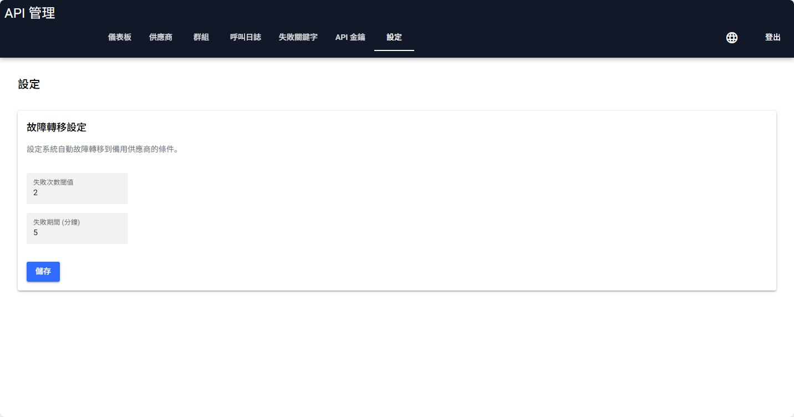
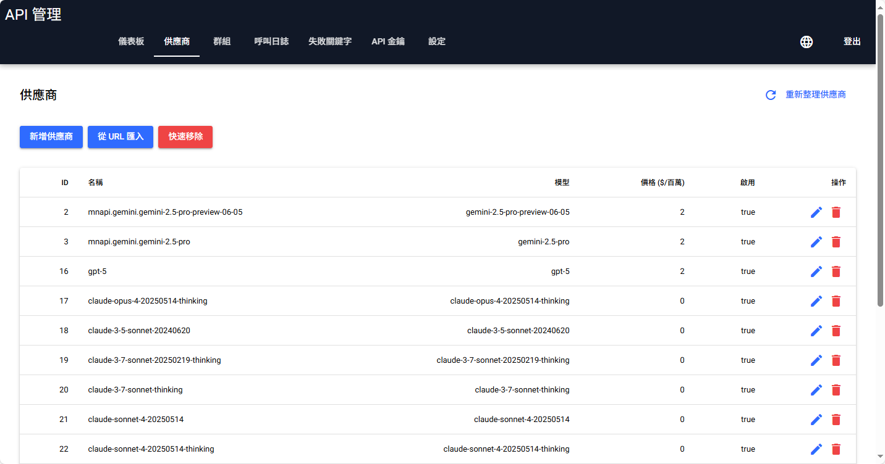
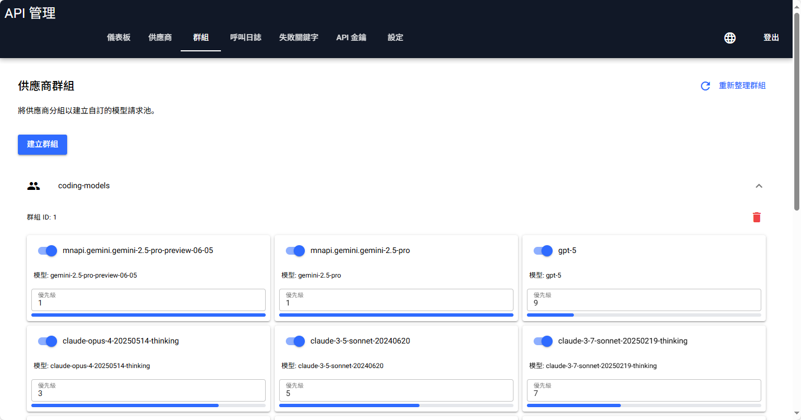
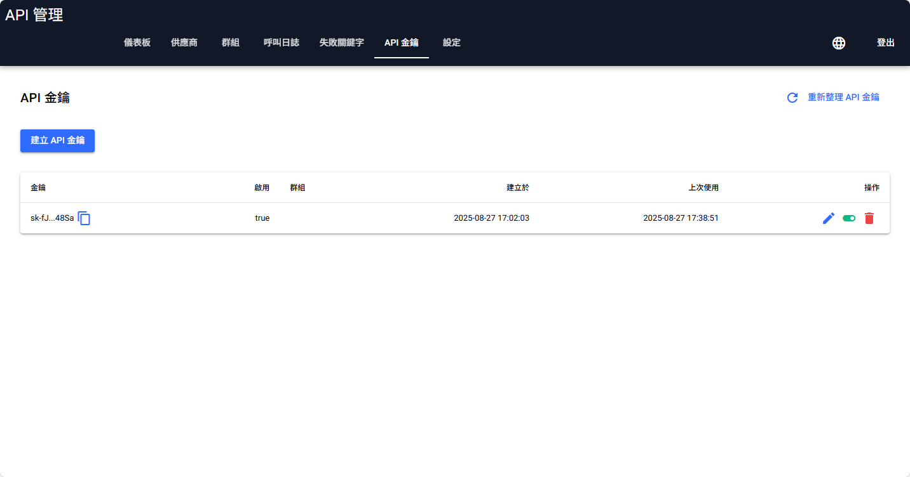
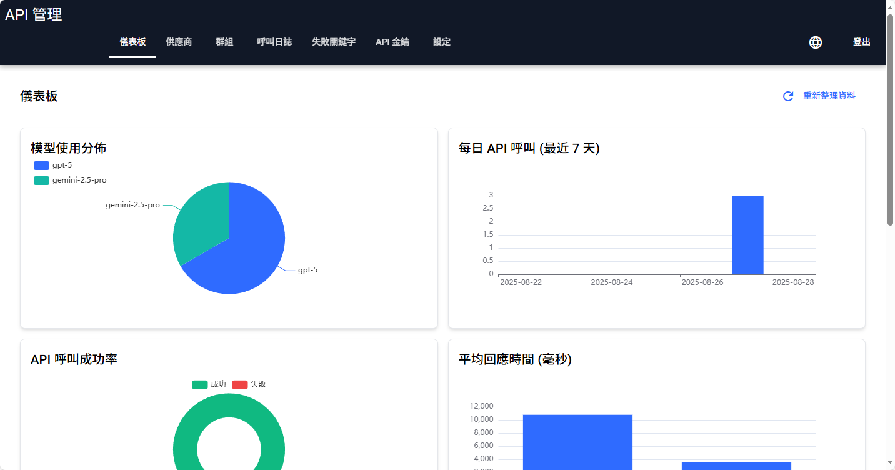

[English](README.md) | [中文](README_ZH.md) | [한국어](README_KO.md) | [日本語](README_JA.md)

---
# AI Provider API 伺服器

一個智慧型 API 伺服器，用於管理並路由對各種 AI 供應商的請求，其靈感來自於頂尖的開源代理伺服器解決方案。此伺服器為各種下游 AI 模型和服務提供了一個統一的、與 OpenAI 相容的 API 端點。其核心優勢在於其強大而靈活的 API 路由和篩選功能。

## ✨ 核心功能：智慧型 API 路由

此伺服器的主要功能是作為您的應用程式與各種 AI 模型供應商之間的智慧中介。您可以定義一個供應商端點池並將它們分組，讓伺服器根據一組規則為每個傳入的請求動態選擇最佳的一個。

### 運作原理

1.  **供應商 (Providers)**：首先，您需要註冊各個 AI 供應商的端點。每個供應商都有自己的 API 金鑰、端點 URL 和成本資訊（例如，每百萬 token 的價格）。

2.  **群組 (Groups)**：接著，您可以建立「群組」並將供應商加入其中。群組作為一個虛擬的、統一的模型端點。例如，您可以建立一個名為 `gpt-4-pool` 的群組，其中包含來自多個供應商、都提供 GPT-4 等級模型的端點。

3.  **基於優先級的路由 (Priority-Based Routing)**：在群組內，您為每個供應商分配一個 `priority`（優先級）數字。當該群組收到請求時，伺服器將首先嘗試使用具有最低優先級數字（例如，優先級 `1`）的供應商。

4.  **自動故障轉移 (Automatic Failover)**：如果最高優先級的供應商失敗（例如，由於 API 錯誤、網路問題或達到速率限制），伺服器會自動且無縫地使用優先級列表中的下一個供應商重試該請求。此過程將持續進行，直到請求成功或群組中的所有供應商都已嘗試過。

5.  **API 呼叫**：您的應用程式發出一個標準的、與 OpenAI 相容的 API 呼叫，但在 `model` 參數中，您指定的不是像 `gpt-4-turbo` 這樣的具體模型名稱，而是您設定的**群組名稱**（例如 `gpt-4-pool`）。

這種架構提供了高可用性、成本優化（透過優先使用較便宜的供應商），並極大地簡化了您客戶端的邏輯。

## 💎 更多功能

*   **與 OpenAI 的相容性**：透過支援 `/v1/chat/completions` 和 `/v1/models` 端點，無縫整合您現有的工具和函式庫。
*   **進階 API 金鑰管理**：產生 API 金鑰並將其精確地分配給特定群組，以實現對模型存取的精細控制。
*   **模型匯入工具**：從任何與 OpenAI 相容的供應商快速匯入模型。支援別名、篩選和關鍵字過濾，以便於整理。
*   **串流支援**：完全支援串流回應，提供即時的聊天機器人體驗。
*   **可設定的故障轉移**：透過網頁介面微調故障轉移邏輯，設定失敗重試的閾值和時間範圍。

## 🖥️ 視覺化管理後台

應用程式包含一個基於 [NiceGUI](https://nicegui.io/) 的現代化、功能豐富的管理後台。

*   **互動式儀表板**：透過多個圖表視覺化 API 使用情況，包括模型分佈、每日流量、成功率和平均回應時間。
*   **多語言支援**：介面支援多種語言，包括英文、中文、日文和韓文。
*   **供應商和群組管理**：在一個直觀的介面中新增、編輯和分組您的 AI 模型供應商。
*   **詳細的呼叫日誌**：檢查每個 API 請求的詳細日誌，包括 HTTP 狀態、回應時間、Token 使用量和成本。
*   **失敗關鍵字**：定義在供應商回應中觸發自動重試的關鍵字。

## 🖼️ 功能展示

| 設定 | 供應商 | 群組 |
| :---: | :---: | :---: |
|  |  |  |
| 設定全域設定，例如 UI 語言和故障轉移重試邏輯。 | 管理您所有的 AI 供應商端點，包括憑證、成本和強大的模型匯入工具。 | 將多個供應商組合在一起，建立一個具有基於優先級的故障轉移功能的虛擬端點。 |

| 呼叫日誌 | API 金鑰 | 失敗關鍵字 |
| :---: | :---: | :---: |
|  |  |  |
| 檢查每個 API 呼叫的詳細日誌。點擊日誌即可查閱完整的回應內容，以及費用詳情。 | 產生 API 金鑰並將其分配給特定群組，以進行精細的存取控制。 | 定義在供應商回應中發現時觸發自動故障轉移的關鍵字。 |

| 儀表板 |
| :---: |
|  |
| 即時監控 API 使用情況、成功率和效能指標，一目了然。 |

##  快速入門

請按照以下說明在您的本機電腦上啟動並執行 API 伺服器。

### 先決條件

*   Python 3.8+
*   一個 ASGI 伺服器，如 Uvicorn

### 安裝步驟

1.  **克隆儲存庫：**
    ```bash
    git clone https://github.com/felixszeto/NiceAPI.git
    cd api_server
    ```

2.  **建立並啟用虛擬環境（建議）：**
    ```bash
    python -m venv venv
    # 在 Windows 上
    venv\Scripts\activate
    # 在 macOS/Linux 上
    source venv/bin/activate
    ```

3.  **安裝依賴套件：**
    ```bash
    pip install -r requirements.txt
    ```

4.  **設定您的環境：**
    建立一個名為 `.env` 的檔案，並填入以下內容：
    ```env
    # .env

    # The database file will be created in the root directory
    DATABASE_URL="sqlite:///./api_server.db"

    # Admin user credentials for the web UI
    ADMIN_USERNAME="admin"
    ADMIN_PASSWORD="password"
    ```
    應用程式預設使用 SQLite，因此初始設定不需要外部資料庫伺服器。您可以根據需要修改 `ADMIN_USERNAME` 和 `ADMIN_PASSWORD`。

### 執行應用程式

應用程式將在首次執行時自動建立並初始化資料庫。

要啟動伺服器，只需執行提供的批次處理檔案：

```bash
start.bat
```

或者，您也可以直接使用 `uvicorn` 執行：

```bash
uvicorn main:app --reload --port 8001 --host 0.0.0.0
```

伺服器將在 `http://localhost:8001` 上提供服務。

## 🖥️ 存取網頁管理介面

伺服器執行後，您可以透過在網頁瀏覽器中導覽至 `http://localhost:8001` 來存取管理介面。

**預設登入憑證：**
*   **使用者名稱：** `admin`
*   **密碼：** `password`

您可以在 `.env` 檔案中修改這些憑證。

登入後，您可以：
*   在**儀表板**上監控 API 使用情況。
*   新增、編輯和**匯入** AI **供應商**。
*   建立**群組**並為其分配具有特定優先級的供應商。
*   產生和管理 **API 金鑰**，並將其指派給群組。
*   查看詳細的 API **呼叫日誌**。
*   管理用於自動故障轉移的**失敗關鍵字**。
*   調整全域**設定**，例如故障轉移邏輯。

## 🤖 API 使用方式

要使用 API，請向 `v1/chat/completions` 端點發送請求。

**重要提示：** 您請求主體中的 `model` 參數應該是您在網頁介面中設定的**群組名稱**。伺服器將根據您的路由規則從該群組中選擇一個供應商。

### `curl` 範例

以下是使用 `curl` 發出請求的範例。請將 `YOUR_API_KEY` 替換為有效的金鑰，並將 `your-group-name` 替換為您要使用的群組名稱。

```bash
curl http://localhost:8001/v1/chat/completions \
  -H "Content-Type: application/json" \
  -H "Authorization: Bearer YOUR_API_KEY" \
  -d '{
    "model": "your-group-name",
    "messages": [
      {
        "role": "user",
        "content": "你好嗎？"
      }
    ],
    "stream": false
  }'
```

回應將是來自所選供應商的標準 OpenAI 相容 JSON 物件。
